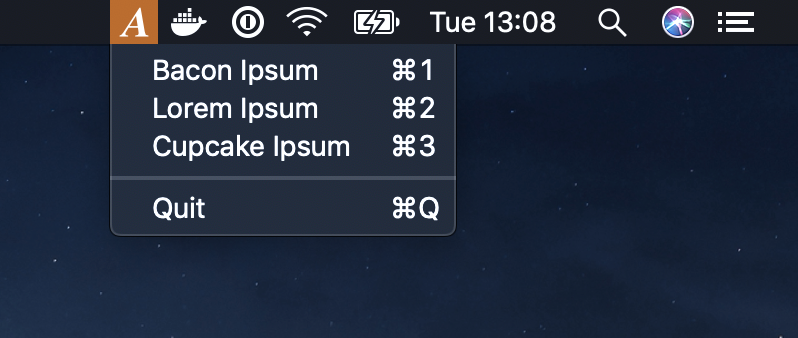

# AnyIpsum

OS X status bar application that lets you select a
[lorem ipsum](https://en.wikipedia.org/wiki/Lorem_ipsum) variation and copy it
to the pasteboard.

Please fork and improve. This was done as a learning experience with Swift.

## Usage

Ipsum variations are stored in `Ipsum.plist`, and will be read upon application
launch.

## License

MIT
