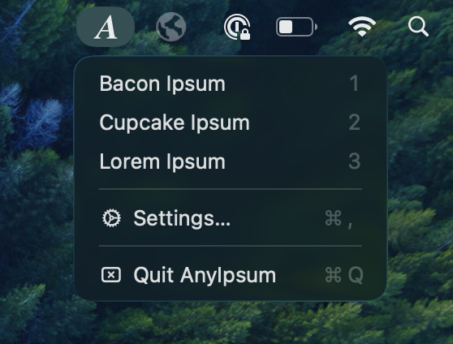

# AnyIpsum

> Lightweight macOS utility for generating [lorem ipsum](https://en.wikipedia.org/wiki/Lorem_ipsum) text from customizable word lists.

## Capabilities

- Choose from built-in lorem ipsum variations in the menu bar.
- Generate randomized paragraphs with 5–7 sentences and 4–8 words per sentence.
- Copy generated paragraphs directly to the pasteboard.
- Open the menu with a configurable global keyboard shortcut.
- Import custom text variations up to 10 KB.
- Delete and reorder variations from Settings.
- Persist custom variations and preferences between launches.



## Prerequisites

macOS Sonoma 14.0 or later

## Install

```sh
brew tap jodelamo/anyipsum
brew install --cask jodelamo/anyipsum/anyipsum
```

Or download the latest disk image from [here](https://github.com/jodelamo/AnyIpsum/releases/latest).

## Example

> Fringilla at donec lorem fringilla. Vulputate fusce elit lectus. Leo arcu elit sollicitudin aliquam. Vulputate posuere fusce fermentum dui vulputate id. Dui fusce sagittis ligula finibus. Interdum arcu quis non ut magna.

## License

MIT
